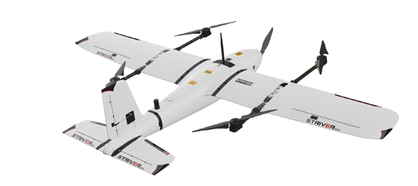

# Introduction
Striver mini VTOL is a 7kg vertical take-off and landing fixed wing UAV manufactured by Makeflyeasy (MFE). It is built for topographic mapping, land survey, engineering survey, digital city, planning and construction, landscape planning, precision agriculture, environmental protection monitoring, ecological monitoring and other fields.

I created this CAD and Realflight model for use with Ardupilot SITL from public information provided by Makeflyeasy on the Striver mini VTOL and simulation endurance test results match closely with endurance flight test results provided by manufacturer.

## Basic Parameters
* Wingspan - 2.1m
* Length - 1.2m
* Height w/o Landing Gear - 156mm 
* Wing Area - 59dm^2
* Cruise Speed - 18 - 21m/s
* Stall Speed - 10m/s
* Max. Payload - 1kg
* Max. Takeoff Weight - 7.5kg

#### Original Aircraft       - [Makeflyeasy](https://en.makeflyeasy.com/index.php/striver-mini-vtol/)
#### CAD & RealFlight 3D Model     - [Ekene Okpara](www.linkedin.com/in/ekene-okpara-188856199)

## ArduPilot Servo Functions
* Servo1 - Aileron
* Servo2 - Elevator
* Servo3 - Throttle
* Servo4 - Rudder
* Servo5 - Motor1
* Servo6 - Motor2
* Servo7 - Motor3
* Servo8 - Motor4